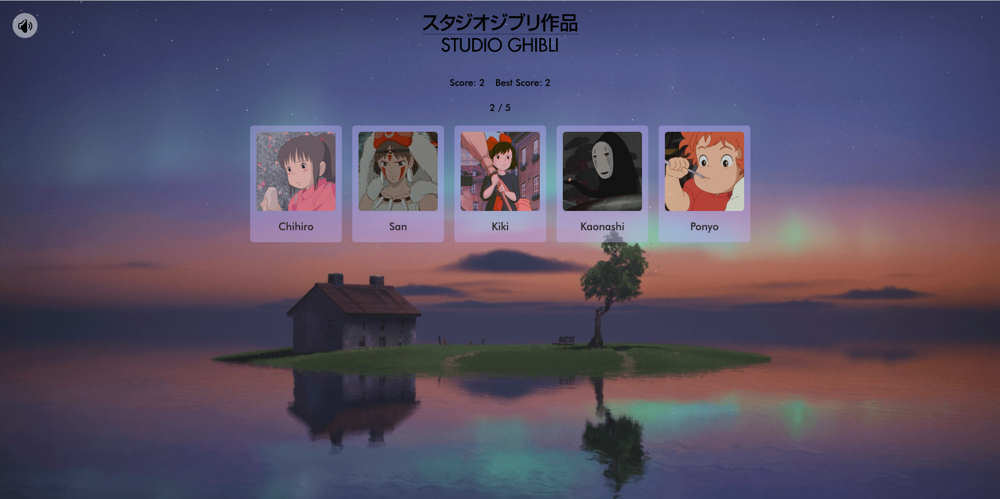

# Studio Ghibli Memory Card Game



Simple memory game created using React, TypeScript, and Vite.

Demo is available here: [DEMO](https://ghibli-memory-game-seven.vercel.app/)

## How Game Works:

1. Select Difficulty Level
2. Turn on music by clicking the speaker button in the top-left corner
3. Select Ghibli Studio characters (You CANNOT select twice!)
4. Beat the game

## Technologies Used:

- **React**
- **Tailwind CSS**
- **TypeScript**
- [**React Parallax Tilt**](https://www.npmjs.com/package/react-parallax-tilt)
- [**React Howler**](https://www.npmjs.com/package/react-howler)
- [**framer-motion**](https://www.npmjs.com/package/framer-motion)

## Getting Started:

#### Installing and running

```
git clone https://github.com/kosunghw/ghibli-memory-game.git
cd ghibli-memory-card
npm install
npm run build
npm run preview
```
